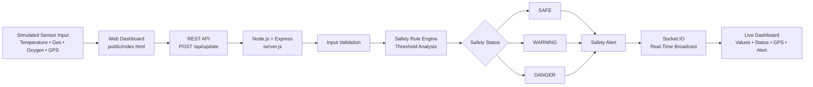
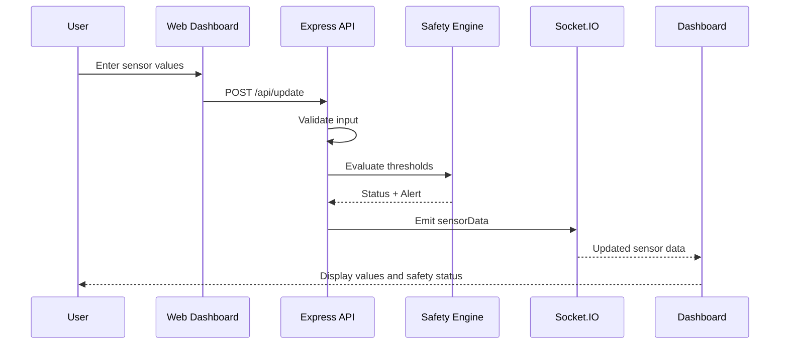

# Smart Mining IoT Safety Monitoring System

> **MCA Academic Project | Real-Time Mining Environment Monitoring Prototype**

A software-based IoT prototype for monitoring critical mining-environment parameters and classifying the environment as **SAFE, WARNING, or DANGER** using predefined safety thresholds.

The system uses a browser-based dashboard, a Node.js/Express backend, REST API communication, and Socket.IO for real-time dashboard updates.

---

## 1. Project Overview

Mining environments can be exposed to hazardous conditions such as excessive temperature, high gas concentration, and reduced oxygen levels. Continuous monitoring of these parameters can help identify abnormal conditions early.

This project demonstrates a **real-time mining safety monitoring workflow** in which sensor values are manually entered as simulated IoT data. The backend validates and evaluates the values, determines the safety status, generates an alert, and broadcasts the updated result to the dashboard.

**Important:** This is a software-only academic prototype. The sensor values and thresholds are demonstration values and must **not** be treated as actual mine-safety limits.

---

## 2. Problem Statement

Mining environments require continuous observation of environmental conditions to identify potentially hazardous situations. Manual observation alone may delay the detection of abnormal conditions.

This project provides a prototype workflow for:

- Collecting simulated environmental readings
- Validating incoming data
- Evaluating readings against predefined thresholds
- Classifying the environment as Safe, Warning, or Danger
- Generating safety alerts
- Displaying updated information in real time

---

## 3. Objectives

- Develop a web-based mining safety monitoring prototype.
- Simulate IoT sensor data for temperature, gas, and oxygen.
- Capture latitude and longitude for location representation.
- Validate sensor values at the backend.
- Implement threshold-based safety classification.
- Generate meaningful safety alerts.
- Provide real-time dashboard updates using Socket.IO.
- Demonstrate an end-to-end IoT data-processing workflow.

---

## 4. Key Features

- 🌡️ Temperature monitoring
- 💨 Gas concentration monitoring
- 🫁 Oxygen-level monitoring
- 📍 GPS / worker-location representation
- 🔍 Backend input validation
- ⚙️ Threshold-based safety evaluation
- 🟢 SAFE / 🟠 WARNING / 🔴 DANGER classification
- 🚨 Safety alert generation
- 📡 Real-time communication using Socket.IO
- 🖥️ Responsive web dashboard
- 🕒 Last-update timestamp
- 🧪 Manual testing with predefined scenarios

---

## 5. System Architecture



---

## 6. Project Workflow

The complete processing flow is:

```text
1. User enters simulated sensor values
                    ↓
2. Web dashboard collects the values
                    ↓
3. Dashboard sends data using HTTP POST
                    ↓
4. Express server receives /api/update
                    ↓
5. Backend validates all input values
                    ↓
6. Safety rule engine evaluates thresholds
                    ↓
7. System determines SAFE / WARNING / DANGER
                    ↓
8. Safety alert is generated
                    ↓
9. Socket.IO broadcasts the updated data
                    ↓
10. Dashboard displays the latest readings,
    GPS coordinates, status, alert and timestamp
```

### Data Flow



---

## 7. Safety Decision Logic

The backend evaluates three environmental parameters.

| Parameter | Safe | Warning | Danger |
|---|---:|---:|---:|
| Temperature | `< 38°C` | `38–44°C` | `≥ 45°C` |
| Gas | `< 1500 ppm` | `1500–1999 ppm` | `≥ 2000 ppm` |
| Oxygen | `≥ 19.5%` | `19–19.4%` | `< 19%` |

### Classification Priority

The system gives priority to dangerous conditions:

```text
If any Danger condition exists
        ↓
     DANGER
        ↓
Else if any Warning condition exists
        ↓
     WARNING
        ↓
Else
        ↓
      SAFE
```

When multiple abnormal parameters are detected, the backend includes the relevant conditions in the generated alert.

> **Safety disclaimer:** The threshold values above are demonstration values implemented for this academic prototype. They are not certified mining or occupational-safety limits.

---

## 8. Application Components

### Frontend

**File:** `public/index.html`

Responsible for:

- Collecting simulated sensor values
- Sending data to the backend
- Displaying sensor readings
- Displaying GPS coordinates
- Showing connection status
- Displaying safety alerts
- Updating the dashboard when Socket.IO data arrives

### Backend

**File:** `server.js`

Responsible for:

- Serving the frontend
- Receiving sensor data
- Validating input
- Evaluating safety thresholds
- Generating status and alerts
- Providing the latest data through an API
- Broadcasting updated data using Socket.IO

---

## 9. API Endpoints

### Update Sensor Data

```http
POST /api/update
```

Example request:

```json
{
  "temperature": 30,
  "gas": 500,
  "oxygen": 20.8,
  "latitude": 17.001234,
  "longitude": 81.778456
}
```

### Get Latest Sensor Data

```http
GET /api/data
```

Returns the latest processed sensor information, including:

- Temperature
- Gas
- Oxygen
- Latitude
- Longitude
- Safety status
- Alert
- Timestamp

---

## 10. Technologies Used

| Technology | Purpose |
|---|---|
| HTML5 | Dashboard structure |
| CSS3 | Dashboard styling and responsive layout |
| JavaScript | Frontend interaction |
| Node.js | Backend runtime |
| Express.js | Web server and REST API |
| Socket.IO | Real-time data broadcasting |
| Git | Version control |
| GitHub | Source-code hosting |

---

## 11. Project Structure

```text
Smart-Mining-IoT/
│
├── public/
│   └── index.html
│
├── .gitignore
├── package.json
├── package-lock.json
├── README.md
└── server.js
```

`node_modules/` is intentionally excluded from GitHub through `.gitignore`.

---

## 12. Requirements

- Node.js
- npm
- Visual Studio Code
- Modern web browser
- Git

---

## 13. Installation and Setup

Clone the repository:

```bash
git clone https://github.com/sruthi18004-prog/Smart-Mining-IoT.git
```

Open the project:

```bash
cd Smart-Mining-IoT
```

Install dependencies:

```bash
npm install
```

---

## 14. Run the Application

Start the server:

```bash
npm start
```

Or:

```bash
node server.js
```

Open the application in a browser:

```text
http://localhost:3000
```

---

## 15. Manual Test Scenarios

### Scenario 1 — Safe

```text
Temperature = 30
Gas = 500
Oxygen = 20.8
```

Expected result:

```text
SAFE
Mining environment is normal.
```

### Scenario 2 — Warning

```text
Temperature = 40
Gas = 1600
Oxygen = 19.4
```

Expected result:

```text
WARNING
```

### Scenario 3 — Danger

```text
Temperature = 48
Gas = 2500
Oxygen = 18
```

Expected result:

```text
DANGER
Emergency alert
```

GPS latitude and longitude can be entered manually to simulate the monitored worker or mining location.

---

## 16. Expected Output

The dashboard displays:

- Current temperature
- Current gas concentration
- Current oxygen level
- GPS latitude and longitude
- IoT connection status
- Safety classification
- Safety alert
- Last update time

The interface changes the visual status indicator according to the result of the safety evaluation.

---

## 17. Advantages

- Simple and easy-to-understand architecture
- Real-time dashboard communication
- Backend-based validation and decision making
- Clear safety classification
- Easy to demonstrate without physical IoT hardware
- Modular separation between frontend and backend
- Suitable as an academic IoT prototype

---

## 18. Current Limitations

- Sensor values are manually simulated.
- No physical sensors are connected.
- No permanent database is implemented.
- Alerts are displayed on the dashboard rather than being sent through SMS/email.
- Thresholds are demonstration values.
- GPS values are manually entered.

---

## 19. Future Scope

The prototype can be extended with:

- Real IoT sensor integration
- ESP32/Arduino-based sensor nodes
- MQTT communication
- Cloud data storage
- Historical sensor-data analysis
- SMS and email emergency notifications
- Interactive maps for worker tracking
- Authentication and role-based access
- Predictive analytics for hazard detection
- Mobile monitoring application

---

## 20. Conclusion

The **Smart Mining IoT Safety Monitoring System** demonstrates how simulated IoT data can be collected, validated, processed, classified, and presented through a real-time web dashboard.

The project combines **Node.js, Express.js, REST APIs, JavaScript, and Socket.IO** to implement an end-to-end safety-monitoring workflow suitable for academic demonstration and further IoT development.

---

## Author

**Sruthi**

GitHub: https://github.com/sruthi18004-prog
